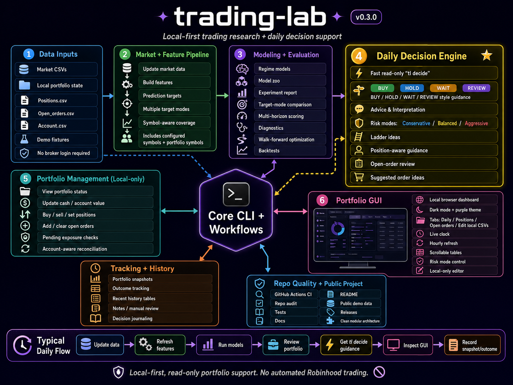
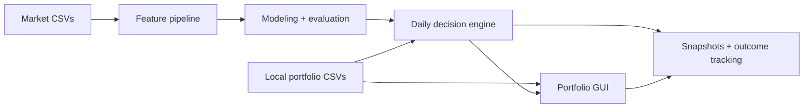

<!-- TRADING_LAB_HERO_START -->
# trading-lab

<p align="center">
  
</p>

<p align="center">
  <a href="https://github.com/aaronjs99/trading-lab/actions/workflows/tests.yml">
    
  </a>
  <a href="https://github.com/aaronjs99/trading-lab/releases/tag/v0.3.0">
    
  </a>
  
  
  
  
</p>

<p align="center">
  <b>Local-first trading research, portfolio-aware decision support, and manual trading review.</b>
</p>

<p align="center">
  <code>market data</code> · <code>features</code> · <code>models</code> · <code>walk-forward evaluation</code> · <code>tl decide</code> · <code>portfolio GUI</code>
</p>

---

**trading-lab** is a local-first research and decision-support toolkit for market regime modeling, walk-forward evaluation, portfolio-aware daily guidance, and manual trading review.

It is built around one principle: **analyze locally, decide deliberately, and never automate broker orders.**

## What it does

| Area | Capability |
|---|---|
| **Market pipeline** | Update market data, build features, generate target labels, and evaluate multiple target modes. |
| **Modeling** | Train and compare regime models, run diagnostics, score latest conditions, and perform walk-forward strategy evaluation. |
| **Daily decision support** | Generate fast `tl decide` guidance with BUY / HOLD / WAIT / REVIEW style output, ladder ideas, blockers, and risk-mode-aware advice. |
| **Local portfolio state** | Track positions, open orders, cash, and account value using gitignored local CSVs. |
| **Portfolio dashboard** | Launch a local browser GUI with Daily, Positions, Open orders, and Edit local CSVs tabs. |
| **Risk modes** | Switch between `conservative`, `balanced`, and `aggressive` decision framing. |
| **History tracking** | Record local portfolio snapshots and decision outcomes for future review. |
| **Repo quality** | Includes CI, audit tooling, tests, public demo fixtures, docs, and release hygiene. |

## Quick start

```bash
# Heavy refresh: market data, features, models, reports
tlfull

# Lightweight decision, no retraining or broker access
tl decide --risk-mode balanced

# Local portfolio dashboard
tl portfolio gui

# Local-only portfolio updates
tl update cash 1624.35
tl update account-value 5000
tl update buy TQQQ 1
tl update sell TQQQ 1
tl update set TQQQ 4
tl update order buy TQQQ 10 58.00
tl update order sell TQQQ 4 68.50

# Record local history
tl portfolio snapshot --risk-mode balanced --notes "morning review"
tl portfolio outcome-record --risk-mode balanced --notes "tracked decision"
```

## Core workflow



## Commands

| Command | Purpose |
|---|---|
| `tlfull` | Heavy refresh: market data, features, models, reports, and plots. |
| `tl decide` | Lightweight read-only decision using existing reports and local files. |
| `tl decide --risk-mode balanced` | Balanced risk/exposure + trend/ladder guidance. |
| `tl decide --risk-mode aggressive` | Trend/risk-seeking framing while still showing exposure warnings. |
| `tl portfolio status` | View local positions, open orders, account/cash, exposure, and trend review. |
| `tl portfolio gui` | Launch the local browser dashboard at `127.0.0.1`. |
| `tl portfolio snapshot` | Append a local portfolio snapshot under gitignored `data/`. |
| `tl portfolio outcome-record` | Record a local decision outcome row for future evaluation. |
| `tl portfolio outcome-update` | Update tracked outcomes using local market CSVs. |

## Risk modes

| Mode | Behavior |
|---|---|
| **Conservative** | Exposure-first. If current or pending exposure exceeds the cap, buy orders are usually marked cancel/reduce. |
| **Balanced** | Blends exposure limits with trend and ladder quality. Deep pullback orders may be reviewed rather than canceled. |
| **Aggressive** | Trend/risk-seeking. Shows exposure warnings but does not automatically reject every deeper buy solely due to conservative exposure limits. |

## Local portfolio files

Local portfolio state is stored under gitignored `data/raw/portfolio/`.

| File | Purpose |
|---|---|
| `positions.csv` | Current local position quantities. Does not store prices. |
| `open_orders.csv` | Manually tracked open limit orders. Does not place/cancel broker orders. |
| `account.csv` | Local cash and account value entries. |

Historical tracking is stored under gitignored `data/processed/portfolio/`.

| File | Purpose |
|---|---|
| `snapshots.csv` | Local portfolio snapshots over time. |
| `decision_outcomes.csv` | Tracked decisions and future outcome fields. |

## Portfolio GUI

The local GUI is a dashboard for viewing and editing local CSV state only.

```bash
tl portfolio gui
```

It includes:

- **Daily**: decision, risk mode, account/cash, blockers, advice, order ideas.
- **Positions**: positions, allocations, price status, and non-model-backed trend review.
- **Open orders**: local open-order table with recommendation/review columns.
- **Edit local CSVs**: local-only forms for positions, cash/account value, and open orders.
- **Snapshots / outcomes**: record local state and track decision usefulness over time.

## Safety model

This repo is designed for **manual decision support only**.

- No Robinhood login required.
- No broker credentials stored.
- No automated order placement.
- Local portfolio files live under gitignored `data/`.
- GUI actions edit local CSVs only.
- Market/model refresh is explicit, not automatic.
- Portfolio status, `tl decide`, snapshots, outcomes, and GUI render are local/read-only with respect to broker accounts.

## Documentation

- [Local portfolio workflow](docs/local_portfolio.md)
- [Portfolio GUI guide](docs/portfolio_gui.md)

<!-- TRADING_LAB_HERO_END -->

## Development

```bash
python -W error -m py_compile $(git ls-files "*.py")
./scripts/tl_test.sh
python -B scripts/audit_repo.py
pytest --durations=20 -q
```

## Release status

Current release: **v0.3.0**

Release highlights:

- Local portfolio/account/open-order state.
- Portfolio-aware `tl decide`.
- Conservative, balanced, and aggressive risk modes.
- Localhost portfolio GUI.
- Non-traded holding trend review.
- Local snapshot history.
- Decision outcome tracking.
- Public demo/data hygiene and documentation.
